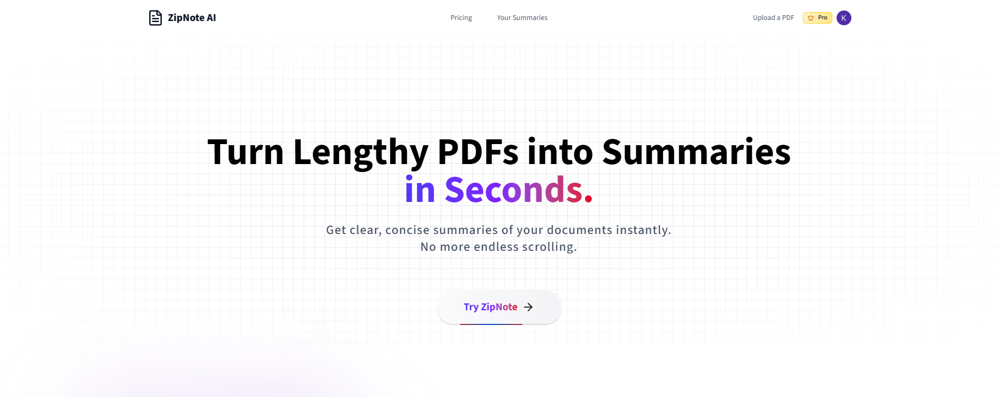

# ZipNote AI - Transform PDFs into a beautiful, impactful summaries with the power of AI!

ZipNote AI is a full-stack application that converts your PDF documents into clear, concise summaries enhanced with AI context and emoji-rich formatting.

Built with Next.js 15 App Router, Clerk for Auth, React, OpenAI GPT-4, Gemini, Langchain, ShadcN UI components, Tailwind CSS 4, NeonDB, UploadThing, Stripe for payments, TypeScript, TailwindCSS and more.



## Features

### Core Technologies:

- Next.js 15 App Router – Leverages server-side rendering, Server Components, and dynamic routing.
- React – Powers reusable, interactive UI components.
- Clerk – Provides secure authentication with support for Passkeys, GitHub, and Google login.
- OpenAI GPT-4 & Gemini – Generates AI-powered summaries with contextual understanding and emoji-enhanced clarity.
- Langchain – Handles PDF parsing, text extraction, and document chunking.
- ShadCN UI – Offers accessible and customizable UI components.
- NeonDB (PostgreSQL) – Manages serverless storage for user data and summaries.
- UploadThing – Facilitates secure PDF uploads (up to 32MB) with seamless file handling.
- Stripe – Manages payments and subscription plans with webhook support.
- TypeScript – Ensures type safety and improved developer experience.
- Tailwind CSS 4 – Enables utility-first, responsive, modern styling.

### Application Features:

- Clean, structured summaries with key points and contextual highlights.
- Interactive summary viewer with progress tracking.
- Secure file uploads and processing pipeline.
- Auth-protected routes and server endpoints.
- Multiple pricing tiers: Basic & Pro.
- Real-time webhook handling for Stripe events.
- Personalized user dashboard for summary management.
- Fully responsive design for mobile and desktop.
- Real-time updates with path revalidation.
- Toast notifications for upload status, processing, and errors.
- Production-optimized deployment.
- SEO-friendly summary pages.

## Getting Started

To get started with this project:

1. Fork the repository.
2. Clone your fork.
3. Install dependencies:

```
npm install
```

3. Copy the environment variables into a separate .env file.
4. Set up required services:

- OpenAI API key
- Clerk authentication
- UploadThing configuration
- Stripe payment setup
- NeonDB database connection

5. Run the development server with 'npm run dev

## Tech Stack Summary

| Category             | Stack                                             |
| -------------------- | ------------------------------------------------- |
| **Frontend**         | Next.js 15, React, Tailwind CSS 4, ShadCN UI      |
| **Backend**          | Server Components, API Routes, Langchain          |
| **Authentication**   | Clerk (Passkeys, GitHub, Google OAuth)            |
| **AI Summarization** | OpenAI GPT-4, Gemini                              |
| **File Handling**    | UploadThing                                       |
| **Database**         | NeonDB (PostgreSQL)                               |
| **Payments**         | Stripe (with webhooks)                            |
| **Language & Tools** | TypeScript, Vercel (deployment), ESLint, Prettier |

[MIT](https://choosealicense.com/licenses/mit/)
